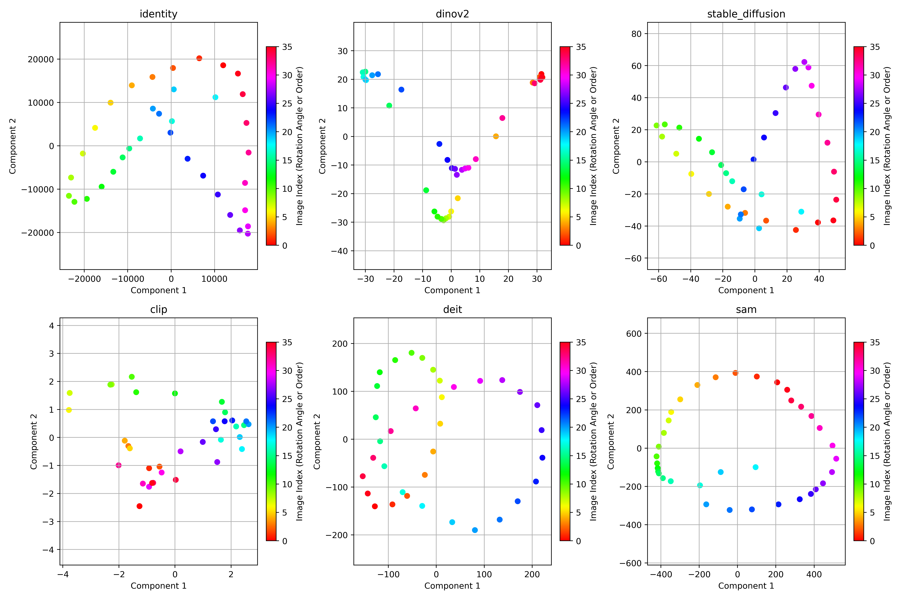
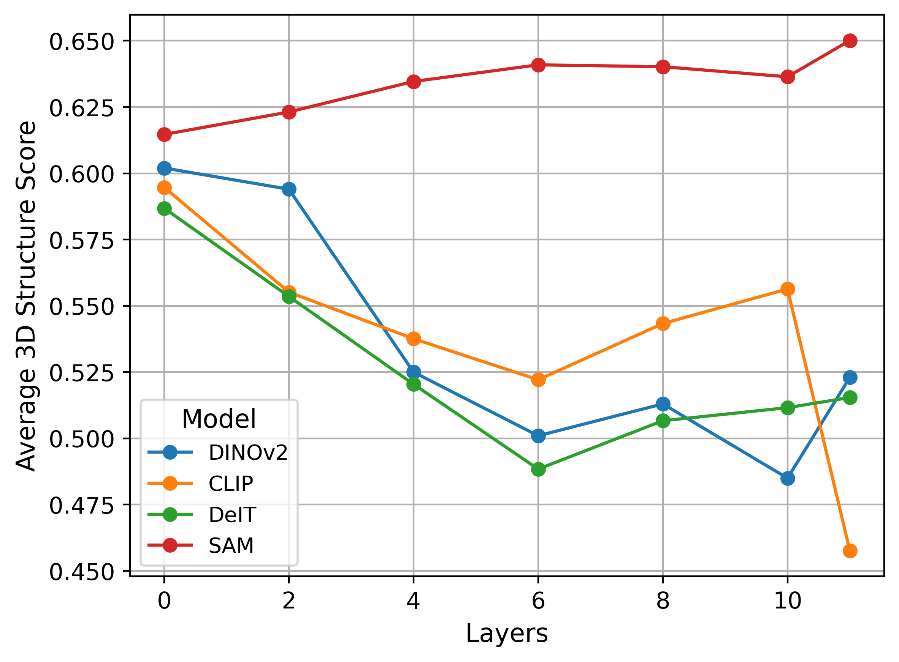
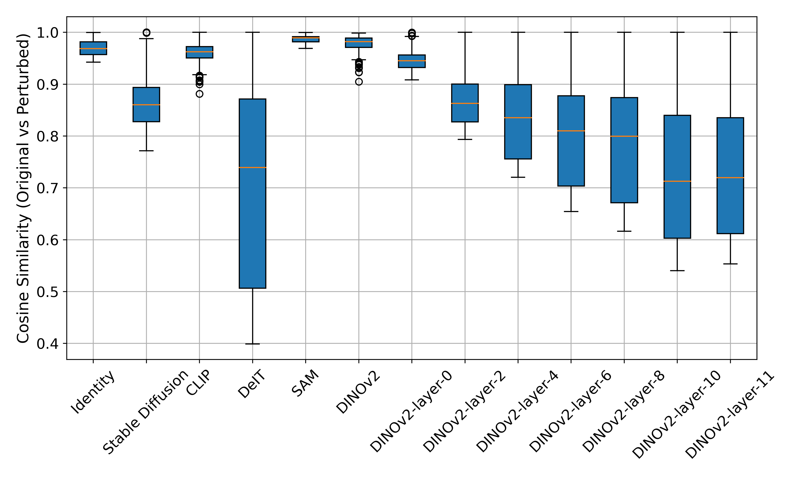

 # Introduction

This is the implementation of our project **"Viewpoint-aware Representation Analysis of Vision Foundation Models"** (ANU COMP8535 project). In particular, we implement four experiments
- **Manifold analysis across models.** We apply PCA, LLE, Isomap, and t-SNE on features extracted by vision models, and evaluate the 3D structure preservation with global metrics (Spearman, Pearson correlation) and local structure metrics (continuity, trustworthiness).
- **Layerwise analysis of DINOv2 representations.**
    We apply PCA on features extracted by different layers of ViT-based models, and evaluate the 3D structure preservation with global metrics (Spearman, Pearson correlation) and local structure metrics (continuity, trustworthiness).
- **Sensitivity to geometric perturbations.** We evaluate the cosine similarity of features extracted by vision models before and after we apply random geometric perturbations.
- **Probing camera pose via nonlinear regression.**
    We train a CNN or an MLP regressor to probe camera pose from features extracted by vision models.

Our results show a clear divide: models trained with dense, pixel-wise supervision (e.g., SAM) tend to preserve local geometric structure and align well with pose-induced manifolds, while those trained with image-level objectives (e.g., DINOv2, CLIP) encode pose more explicitly and support accurate regression, but at the cost of geometric transparency. These encoding strategies are further shaped by depth: deeper layers increasingly favor global abstraction. Together, our findings highlight the importance of both supervision and architecture in shaping 3D-aware representations and call for future work on geometry-aware objectives and hybrid training paradigms that can unify structural fidelity with predictive precision.
 
 # File organization

 - dim_reductor.py:
    - Implmentation of PCA, LLE, Isomap, and t-SNE.

- metrics.py:
    - Implmenetation of spearman, pearson, continuity, trustworthiness.

- vision_models.py:
    - Implementation of vision models.

- visualizer.py:
    - Visualize the results of PCA, LLE, Isomap, and t-SNE.
    - [Visualize reducted features](#visualize-reducted-features)

- quantitizer.py
    - Evaluating the results of PCA, LLE, Isomap, and t-SNE with metrics (spearman, pearson, continuity, trustworthiness).
    - [Quantitize reducted features](#quantitize-reducted-features)

- low_level_perturbation_2D.py
    - Evaluating the sensitivity of vision models with random perturbations.
    - [Sensitivity to geometric perturbations.](#sensitivity-to-geometric-perturbations)

- evaluate_angle_predictability.py
    - Evaluate the angle predictability with vision models.
    - [Probing camera pose via nonlinear regression.](#probing-camera-pose-via-nonlinear-regression)

# Data

Data available at https://drive.google.com/file/d/1lwpkNH9gYEBRwzYE6XU6Jx8qZXGnbl5m/view?usp=drive_link
 
 # Manifold analysis across models.

 ## Visualize reducted features

```bash
python .\visualizer.py --embedding PCA --folder_path path/to/data --model_name identity dinov2 stable_diffusion clip deit sam --save_path ..\fig
```



## Quantitize reducted features

### Supported arguments

- model_name
    - identity: original images
    - dinov2
        - dinov2-vit_layer-0: image tokens from layer 0 of dinov2.
    - stable_diffusion
        - Do not support specify layers
    - clip
        - clip-vit_layer-1: image tokens from layer 1 of clip.
    - deit
        - deit-vit_layer-2: image tokens from layer 2 of clip.
    - sam
        - sam-vit_layer-3: image tokens from layer 3 of clip.

- metrics:
    - spearman_correlation
    - pearson_correlation
    - continuity
    - trustworthiness

- embedding
    - LLE
    - Isomap
    - TSNE
    - PCA
    - MDS

- folder_path: path to the data

## Example of commands

PCA with different vision models and metrics on different data
```bash
python .\quantitizer.py --embedding PCA --folder_path path/to/data1 path/to/data2 --model_name identity dinov2 stable_diffusion clip deit sam --metrics spearman_correlation pearson_correlation continuity trustworthiness
```

T-SNE with different vision models and metrics on different data
```bash
python .\quantitizer.py --embedding TSNE --folder_path path/to/data ..\Desk_food\render ..\Excavator\render ..\Rhino\render ..\room2\render desk room --model_name identity dinov2 stable_diffusion clip deit sam --metrics spearman_correlation pearson_correlation continuity trustworthiness
```


## Results

| Model | spearman_correlation | pearson_correlation | continuity | trustworthiness | Average |
|---|---|---|---|---|---|
| Identity | <ins>0.4810385313</ins> | <ins>0.3878832454</ins> | **0.7507984774** | <ins>0.8104647524</ins> | <ins>0.6075462516</ins> |
| DINOv2 | 0.3828479167 | 0.2989504329 | 0.6543015981 | 0.7755273736 | 0.5279068303 |
| Stable Diffusion | 0.4619470529 | 0.3830731365 | 0.7198126338 | 0.7845092635 | 0.5873355216 |
| CLIP | 0.3345586678 | 0.2536421071 | 0.5881998197 | 0.7244606021 | 0.4752152992 |
| DeiT | 0.3454608094 | 0.2722028005 | 0.6864571678 | 0.7316427498 | 0.5089408819 |
| SAM | **0.5161895883** | **0.4358792155** | <ins>0.7496740198</ins> | **0.8215865546** | **0.6308323445** |

Full data: https://docs.google.com/spreadsheets/d/1mw0KEf0RTXP8W9ieeRIQ9q8a0unjllgue8j5YSoRr_M/edit?usp=sharing

# Layerwise analysis of representations.

## Example of command
PCA with different layers of deit and metrics on different data
```bash
python .\quantitizer.py --embedding PCA --folder_path path/to/data1 path/to/data2 --model_name deit-vit_layer-0 deit-vit_layer-2 deit-vit_layer-4 deit-vit_layer-6 deit-vit_layer-8 deit-vit_layer-10 deit --metrics spearman_correlation pearson_correlation continuity trustworthiness
```

## Result



# Sensitivity to geometric perturbations.

## Example of command

```bash
python .\low_level_perturbation.py --folder_path path/to/data --model_name identity stable_diffusion clip deit sam dinov2 dinov2-layer-0 dinov2-layer-4 dinov2-layer-9 dinov2-layer-14 dinov2-layer-19 dinov2-layer-24 dinov2-layer-29 dinov2-layer-34 dinov2-layer-39  --save_path ..\fig
```

## Result




# Probing camera pose via nonlinear regression.

## Example of command
```bash
python .\evaluate_angle_predictability.py --folder_path path/to/data --model_name identity stable_diffusion clip deit sam dinov2 dinov2-layer-0 dinov2-layer-4 dinov2-layer-9 dinov2-layer-14 dinov2-layer-19 dinov2-layer-24 dinov2-layer-29 dinov2-layer-34 dinov2-layer-39 --save_path ..\fig
```

## Result
