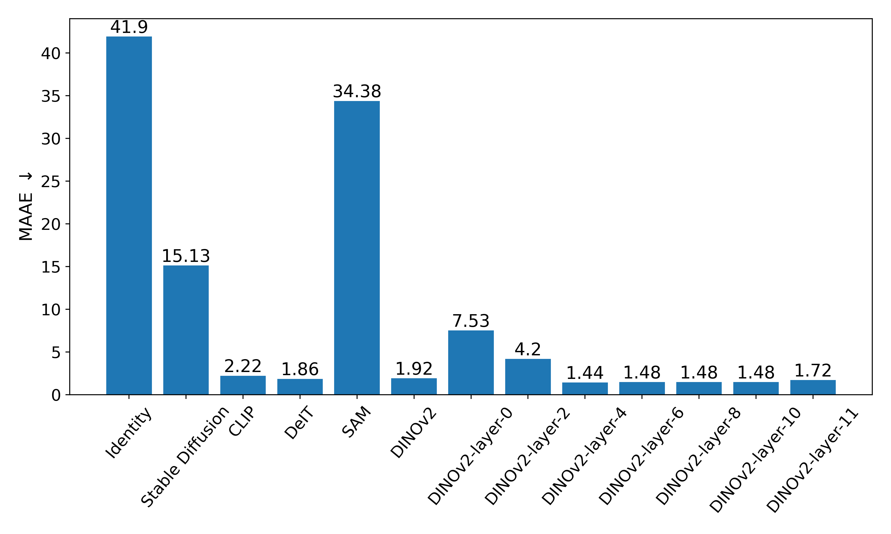

 # File organization

 - dim_reductor.py:
    - Implmentation of PCA, LLE, Isomap, and t-SNE.

- metrics.py:
    - Implmenetation of spearman, pearson, continuity, trustworthiness.

- vision_models.py:
    - Implementation of vision models.

- visualizer.py:
    - Visualize the results of PCA, LLE, Isomap, and t-SNE.
    - [Visualize reducted features](#visualize-reducted-features)

- quantitizer.py
    - Evaluating the results of PCA, LLE, Isomap, and t-SNE with metrics (spearman, pearson, continuity, trustworthiness).
    - [Quantitize reducted features](#quantitize-reducted-features)

- low_level_perturbation_2D.py
    - Evaluating the sensitivity of vision models with random perturbations.
    - [Low-level perturbation](#low-level-perturbation)

- evaluate_angle_predictability.py
    - Evaluate the angle predictability with vision models.
    - [Angle predictability](#angle-predictability)

# Data

Data available at https://drive.google.com/file/d/1lwpkNH9gYEBRwzYE6XU6Jx8qZXGnbl5m/view?usp=drive_link
 
 # Visualize reducted features

<!-- lle with original images:
```bash
python .\visualizer.py --folder_path desk --model_name identity --scaler StandardScaler
```

lle with dinov2:
```bash
python .\visualizer.py --folder_path desk --model_name dinov2 
```

lle with stable_diffusion 
```bash
python .\visualizer.py --folder_path desk --model_name stable_diffusion 
```

lle with clip
```bash
python .\visualizer.py --folder_path desk --model_name clip 
```

lle with deit
```bash
python .\visualizer.py --folder_path desk --model_name deit 
```

lle with sam (need to download the checkpoint from https://github.com/facebookresearch/segment-anything, vit-b)
```bash
python .\visualizer.py --folder_path desk --model_name sam --checkpoint_path 'path/to/checkpoint_sam' 
``` -->

```bash
python .\visualizer.py --embedding PCA --folder_path path/to/data --model_name identity dinov2 stable_diffusion clip deit sam --save_path ..\fig
```


# Quantitize reducted features

## Supported arguments

- model_name
    - identity: original images
    - dinov2
        - dinov2-layer-0: image tokens from layer 0 of dinov2
    - stable_diffusion
    - clip
    - deit
    - sam

- metrics:
    - spearman_correlation
    - pearson_correlation
    - continuity
    - trustworthiness

- embedding
    - LLE
    - Isomap
    - TSNE
    - PCA
    - MDS

- folder_path: path to the data

## Example of commands

PCA with different vision models and metrics on different data
```bash
python .\quantitizer.py --embedding PCA --folder_path path/to/data ..\Desk_food\render ..\Excavator\render ..\Rhino\render ..\room2\render desk room --model_name identity dinov2 stable_diffusion clip deit sam --metrics spearman_correlation pearson_correlation continuity trustworthiness
```

T-SNE with different vision models and metrics on different data
```bash
python .\quantitizer.py --embedding TSNE --folder_path path/to/data ..\Desk_food\render ..\Excavator\render ..\Rhino\render ..\room2\render desk room --model_name identity dinov2 stable_diffusion clip deit sam --metrics spearman_correlation pearson_correlation continuity trustworthiness
```

PCA with different dinov2 with different layers and metrics on different data
```bash
python .\quantitizer.py --embedding PCA --folder_path path/to/data ..\Desk_food\render ..\Excavator\render ..\Rhino\render ..\room2\render desk room --model_name dinov2-layer-4 --metrics spearman_correlation pearson_correlation continuity trustworthiness
```

## Results

| Model | spearman_correlation | pearson_correlation | continuity | trustworthiness | Average |
|---|---|---|---|---|---|
| Identity | <ins>0.4810385313</ins> | <ins>0.3878832454</ins> | **0.7507984774** | <ins>0.8104647524</ins> | <ins>0.6075462516</ins> |
| DINOv2 | 0.3828479167 | 0.2989504329 | 0.6543015981 | 0.7755273736 | 0.5279068303 |
| Stable Diffusion | 0.4619470529 | 0.3830731365 | 0.7198126338 | 0.7845092635 | 0.5873355216 |
| CLIP | 0.3345586678 | 0.2536421071 | 0.5881998197 | 0.7244606021 | 0.4752152992 |
| DeiT | 0.3454608094 | 0.2722028005 | 0.6864571678 | 0.7316427498 | 0.5089408819 |
| SAM | **0.5161895883** | **0.4358792155** | <ins>0.7496740198</ins> | **0.8215865546** | **0.6308323445** |

Full data: https://docs.google.com/spreadsheets/d/1mw0KEf0RTXP8W9ieeRIQ9q8a0unjllgue8j5YSoRr_M/edit?usp=sharing

# Quantitize reducted features per-layer with DINOv2


# Low-level perturbation

```bash
python .\low_level_perturbation_2D.py --folder_path path/to/data --model_name identity stable_diffusion clip deit sam dinov2 dinov2-layer-0 dinov2-layer-4 dinov2-layer-9 dinov2-layer-14 dinov2-layer-19 dinov2-layer-24 dinov2-layer-29 dinov2-layer-34 dinov2-layer-39  --save_path ..\fig
```


<!-- ```bash
python .\low_level_perturbation_3D.py --folder_path ..\Case\render_perturbed --model_name sam dinov2 dinov2-layer-0 dinov2-layer-4 dinov2-layer-9 dinov2-layer-14 dinov2-layer-19 dinov2-layer-24 dinov2-layer-29 dinov2-layer-34 dinov2-layer-39 --save_path ..\fig
``` -->

<!--  -->

# Angle predictability

```bash
python .\evaluate_angle_predictability.py --folder_path path/to/data --model_name identity stable_diffusion clip deit sam dinov2 dinov2-layer-0 dinov2-layer-4 dinov2-layer-9 dinov2-layer-14 dinov2-layer-19 dinov2-layer-24 dinov2-layer-29 dinov2-layer-34 dinov2-layer-39 --save_path ..\fig
```

